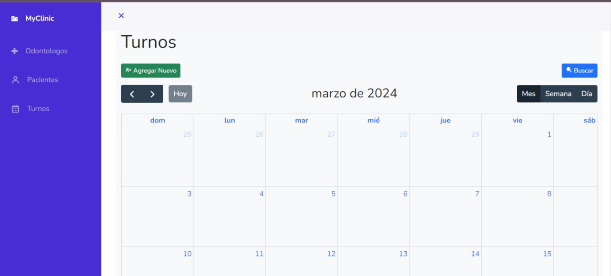
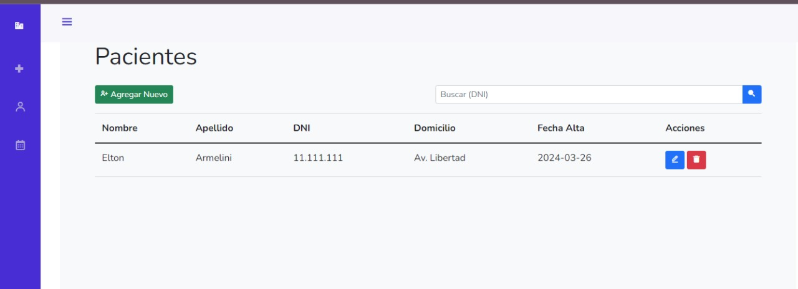
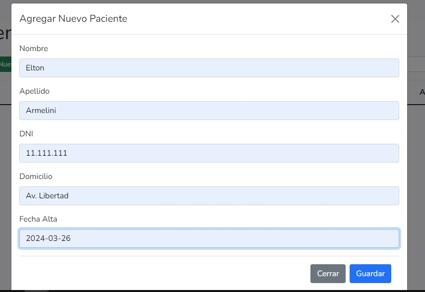
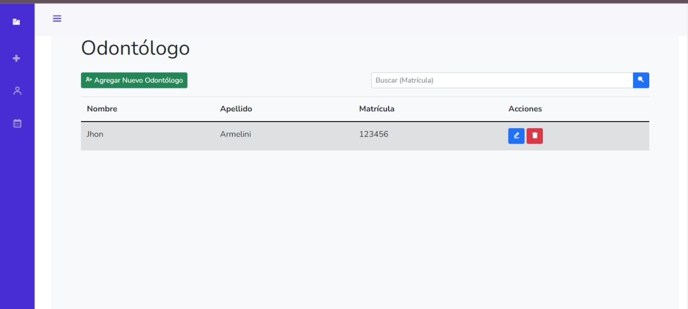

# MyClinic

Proyecto Full Stack Web construido basandose en un modelo de 3 capas: 
- Front End
- Back End
- API

La aplicacion está hecha con el fin de mostrar el funcionamiento de APIs contruidos con Spring Web de Spring Boot, en el cual se desarrollan endoints con la finalidad de realizar las operaciones ABM o CRUD. 

Front End construido con: 
- **HTML**
- **CSS**
- **JS Vanilla**
- **Bootstrapp v5**

Back End construido con: 
- Java 21
- Sping: **Spring Boot**, **Spring JPA** con **Hibernate** ORM 
- **JUnit 5** para tests
- Base de Datos SQL **H2**
- Gestor de Proyecto y dependencias **Maven**

La Aplicación está construida siguiendo una arquitectura en capas. 

## Capa de Configuración (`config/`): 
Contiene las configuraciones de la aplicación, como la configuración de ModelMapper y la configuración web.

- `ModelMapperConfig.java`: Configuración de ModelMapper para mapeo de objetos.
- `WebConfig.java`: Configuración de la aplicación web.

## Capa de Controladores (`controller/`):
Contiene los controladores que manejan las solicitudes HTTP y coordinan la lógica de negocio.

- `OdontologoController.java`: Controlador para operaciones relacionadas con odontólogos.
- `PacienteController.java`: Controlador para operaciones relacionadas con pacientes.
- `TurnoController.java`: Controlador para operaciones relacionadas con turnos.

## Capa de DTOs (`dto/`): 
Contiene los objetos de transferencia de datos, que se utilizan para transferir datos entre la capa de presentación y la capa de servicio.

- `request/`: DTOs para solicitudes.
  - `OdontologoRequestDTO.java`: DTO para solicitudes relacionadas con odontólogos.
  - `PacienteRequestDTO.java`: DTO para solicitudes relacionadas con pacientes.
  - `TurnoEditRequestDTO.java`: DTO para solicitudes de edición de turno.
  - `TurnoRequestDTO.java`: DTO para solicitudes relacionadas con turnos.
- `response/`: DTOs para respuestas.
  - `OdontologoResponseDTO.java`: DTO para respuestas relacionadas con odontólogos.
  - `PacienteResponseDTO.java`: DTO para respuestas relacionadas con pacientes.
  - `TurnoResponseDTO.java`: DTO para respuestas relacionadas con turnos.
  - `TurnoSerchByOdontologoResponseDTO.java`: DTO para respuestas de búsqueda de turnos por odontólogo.

## Capa de Entidades (`entity/`): 
Contiene las entidades JPA que representan las tablas de la base de datos.

- `Odontologo.java`: Entidad de odontólogo.
- `Paciente.java`: Entidad de paciente.
- `Turno.java`: Entidad de turno.

## Capa de Excepciones (`exceptions/`): 
 Contiene las clases de excepción personalizadas para manejar errores específicos de la aplicación.

- `GloabalExceptionHandler.java`: Manejador de excepciones global.
- `ResourceNotFoundException.java`: Excepción para recurso no encontrado.
- `UniqueConstraintException.java`: Excepción para violación de restricción única.

## Capa de Repositorios (`repository/`): 
Contiene los repositorios JPA que manejan la interacción con la base de datos.

- `IOdontologoRepository.java`: Repositorio para odontólogos.
- `IPacienteRepository.java`: Repositorio para pacientes.
- `ITurnoRepository.java`: Repositorio para turnos.

## Capa de Servicios (`service/`)

- `IOdontologoService.java`: Interfaz para servicio de odontólogos.
- `IPacienteService.java`: Interfaz para servicio de pacientes.
- `ITurnoService.java`: Interfaz para servicio de turnos.

### Implementaciones de Servicios (`service/implementation/`):
  Contiene los servicios que implementan la lógica de negocio de la aplicación

- `OdontologoService.java`: Implementación de servicio para odontólogos.
- `PacienteService.java`: Implementación de servicio para pacientes.
- `TurnoService.java`: Implementación de servicio para turnos.
